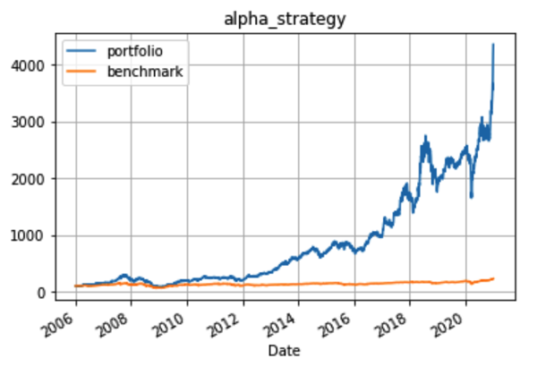
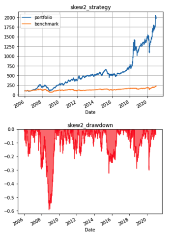
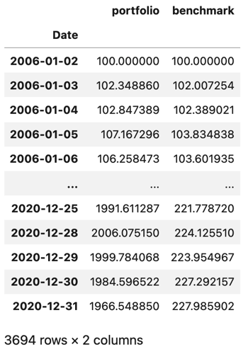

# 單因子策略 理財機器人回測

作者：江祐宏 Alex Chiang

背景：東吳大學 財務工程與精算數學系 大四

完成日期：2021/6/12

* [一、專案簡介](#專案簡介)
  * [理財機器人架構](#理財機器人架構)
  * [回測範例績效](#回測範例績效)
* [二、使用方法](#使用方法)
* [三、程式使用說明](#程式使用說明)
  * [初始設置](#初始設置)
  * [量化績效指標](#量化績效指標)
  * [績效與回撤圖](#績效與回撤圖)
  * [資產收益細節](#資產收益細節)
* [四、未來](#未來)
  * [前置作業](#前置作業)
* [五、更新](#更新)
  * [影片分享](#影片分享)
  * [補充-配對交易](#補充-配對交易)
  * [補充-更新股價資料](#補充-更新股價資料)
  * [補充-美股投資](#補充-美股投資)

---

## 專案簡介
將 2004 ~ 2020 年台灣市值前 150 大的股票（刪除早期未上市，共 108 檔）與台灣加權股價指數之 **調整後收盤價** 做一個簡易的回測系統，模擬 2006 ~ 2020 年真實交易歷程，實證理財機器人的可行性。

#### 理財機器人架構：
1. **即將更新**
2. 單因子選股－CAMP 模型的 alpha, beta 指標；資產報酬率的偏態係數
3. 投資組合最佳化－Markowitz 均異最適化模型
4. 定期再平衡
5. 停損再平衡

#### 回測範例績效


## 使用方法
下載此 repository，安裝相關套件後可直接於 jupyter notebook 執行 [主程式](main.ipynb)。

* [主程式執行環境需求](requirements.txt)
* Python 版本：3.7.4

> 註：可以自行更換 [股票資料](dataset/TW150_CloseAdj.csv) 與 [大盤股價](dataset/TWII_CloseAdj.csv)，需注意：(1)兩者的日期要統一 (2)事先移除缺漏值 (3)檔案格式和內建檔案相同。若有其他需求可以於 [套件模組](module/data.py) 中自行調整。


## 程式使用說明

#### 初始設置
```python
Backtest(strategy = 'alpha',
         beginning_money = 100, 
         start_day = '2006-01-01', 
         feature_period = 240, 
         selected_from_last = False,
         n_stock = 5, 
         max_percentage = 0.2, 
         rebalance = 240, 
         dynamic_rebalance = False, 
         stop_loss = 0.3)
```

**(1) strategy** = ['alpha', 'beta', 'skew1', 'skew2']

`使用哪一個因子作為選股方法（Required）`

* alpha: CAPM 模型之截距項
* beta: CAPM 模型之斜率項
* skew1: 每日報酬率計算的偏態
* skew2: 每年報酬率計算的偏態

> 註：策略因子可於 [套件模組](module/calculate.py) 中自行調整

**(2) beginning_money**

`起始金額為多少錢（預設為 100）`

**(3) start_day**

`從哪一天開始交易（預設為 2006/1/1）`

> 註：需設定在 2006 年之後  

**(4) feature_period** 

`策略因子取自多長的時間製作（預設為 240）`

> 註：建議不少於 60。當超過 240 的 n 天，start_day 需向後 n 個交易日才可執行（不然算不出早期的策略因子，會導致執行失敗）

**(5) selected_from_last** = [True, False]

`選取該因子最大項或最小項為選股標準（預設為 False）`

* True 選取因子最小者
* False 選取因子最大者

**(6) n_stock**

`每次將幾檔股票放入投資組合（預設為 5）`

> 註：建議以 3 5 8 10 為主

**(7) max_percentage** 

`每一檔股票的最大配置比重（預設為 0.2）`

> 註：最小必須為 1 / n_stock；最大為 1

**(8) rebalance** 

`幾個交易日做一次靜態再平衡（預設 240）`

> 註：若設定 10000，將不會有靜態平衡的條件

**(9) dynamic_rebalance** = [True, False] 

`是否做停損再平衡（預設為 False）`

**(10) stop_loss** 

`設置停損百分比（預設為 0.3）`

> 註：當 dynamic_rebalance = True，才會執行此條件


#### 量化績效指標
```python
self.show_index(index = 'Sharpe_ratio')
```

index 可填入以下八種指標，或呈現全部
1. Max_drawdown
2. Accumulation_return
3. Annual_return
4. Annual_volatility
5. Neg_annual_volatility
6. Sharpe_ratio
7. Sortino_ratio
8. Calmar_ratio
9. All

#### 績效與回撤圖

```python
self.show_portfolio()
```



#### 資產收益細節

```python
self.portfolio_benchmark
```


## 未來
在這次的專案中發現，設置停損點後，整體績效不一定會提升，多數時候反而降低。我猜想是因為，在一個下跌的趨勢用相同的因子找股票，怎麼樣都不會選出差異太多的股票。雖然目前的投資績效已經大贏大盤，然而，人性卻沒辦法接受投資組合跌到 30% 甚至 40%，因此，停損的設計在實單交易中甚是必要。

從這次的專案過程，我找出了幾個在多數情況都可以有好表現的因子（例如 skew, alpha），但假如希望投資績效可以再創新高、且符合投資人的期待，勢必不能只做單因子選股，而是要在任何情況下都有辦法賺錢，使績效能夠穩定成長。因此，我期待下一階段能夠做出「多因子策略」的理財機器人，**找出在「不同投資環境」下，「獲利表現最好的因子」**。

#### 前置作業
1. 利用機器學習分群，判斷不同的投資環境
2. 或主觀地利用技術指標判斷－(1)波動小 盤整 (2)波動大 盤整 (3)上升趨勢 (4)下跌趨勢 四種投資環境
3. 找出每一個投資環境下，最會賺錢的因子

若您對下一階段的專案有興趣；或想要一起優化理財機器人；或是想了解更多此份 repository，都歡迎寄信與我討論！

##### 江祐宏 Alex Chiang
##### 個人email: atigerhh@gmail.com


---
---

## 更新

#### 影片分享 
於台灣金融研訓院所舉辦的活動【FinTech 校園點子王 金融科技創新成果發表會】小小的專案分享
##### [輕鬆介紹理財機器人與商業模式發想 2021/6/30](https://youtu.be/6CG_qmihqOA)

#### 補充-配對交易
利用兩檔具相關性的股票，觀察過去一段期間的平均價差，在價差失衡的時候同時進行一多一空的套利交易
* 回測使用複利系統
* 單利系統（每次投入相同金額）可再自行微調
##### [程式實作檔案 2021/7/5](補充_配對對沖練習.ipynb)

#### 補充-更新股價資料
一鍵更新資料庫中的 csv 檔
* 程式碼存放於 Google Colab 中
* 順便附上了證交所爬蟲程式碼
##### [更新股價_Colab](https://colab.research.google.com/drive/1YseB1XUigvjcX0QmtI1vU2E6T1qgAwMt?usp=sharing)

#### 補充-美股投資
牛市追蹤美國大盤、熊市追蹤美國公債，回測長期被動投資的累積報酬
* 程式碼存放於 Google Colab 中
##### [美股投資_Colab](https://colab.research.google.com/drive/13B_xZ6f8IDduGShKgAoWfxuHvufmP46p?usp=sharing)

